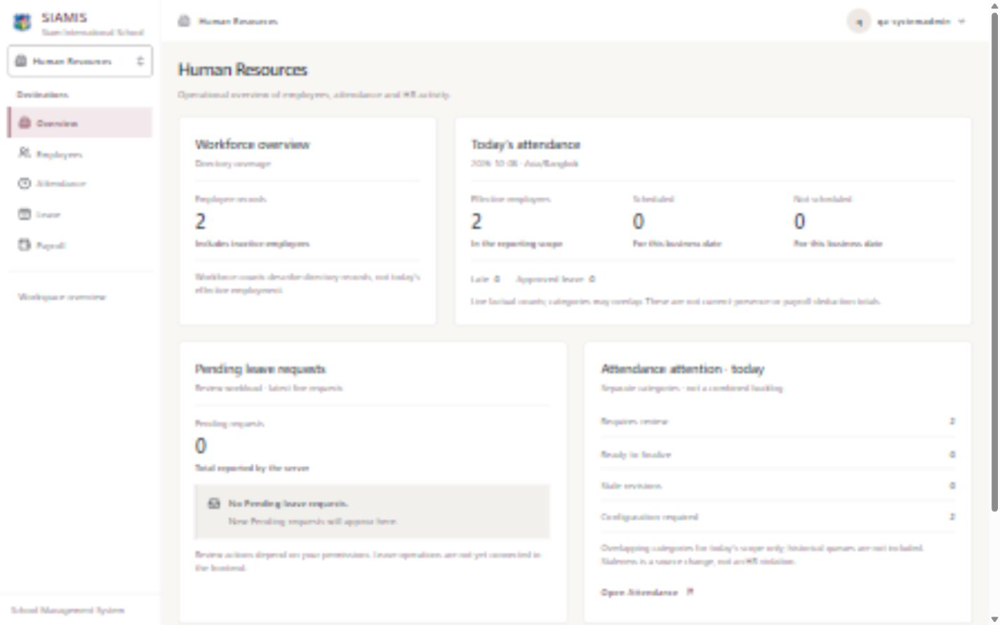
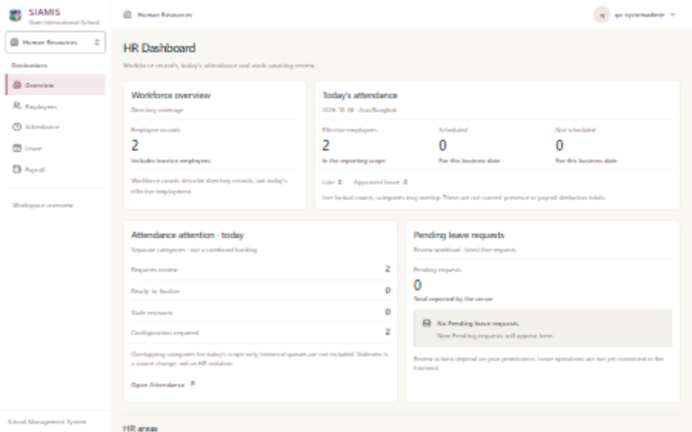
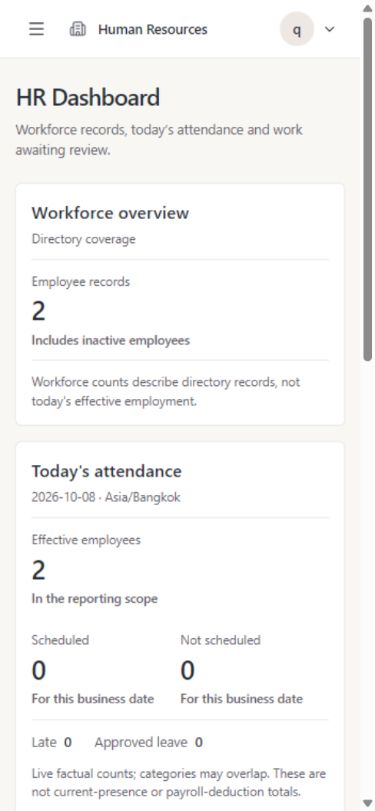

# SIAMIS V3.4 — Premium HR Dashboard

Status: **READY FOR PRODUCT-OWNER REVIEW. Not committed or pushed.**

Review: http://localhost:5175/hr (normal authenticated session with Reporting.Read).

## Existing dashboard audit

The existing dashboard already had bounded, independent queries, named sections, capability-filtered links and honest empty/error states. Its presentation used comfortable metrics and large panel padding, repeated date context, and placed leave before attendance review in the mobile reading order. The generic Human Resources page title did not explicitly identify the dashboard. Workflow shortcuts also described all operational screens as foundations even though Employee and Attendance workspaces now exist.

The V3.0 concerns addressed here are dashboard density, hierarchy, spacing, grouping and intermediate-width wrapping. The approved V3.1 semantic tokens/components and V3.2 content frame remain authoritative; no second outer gutter or duplicate page heading was introduced. V3.3 authentication is unchanged.

### Actual data and definitions

| Existing GET query                              | Capability     | Dashboard facts                                                                                                                                                                      |
| ----------------------------------------------- | -------------- | ------------------------------------------------------------------------------------------------------------------------------------------------------------------------------------ |
| `/api/employees?page=1&pageSize=1`              | Employee.Read  | Directory totalCount, including inactive employees. Not active headcount or today's employment population.                                                                           |
| `/api/attendance/today?page=1&pageSize=1`       | Reporting.Read | Server business date/time zone, effective employees, scheduled/not scheduled employee dates, Late, Approved leave and four separate attention categories. Counts precede pagination. |
| `/api/leave-requests/pending?page=1&pageSize=5` | Leave.Read     | Server Pending total and up to five recent requests, including employee name/number, leave type, dates and actual status.                                                            |

The attendance overview is reused for attention; no fourth query was added. Attention categories overlap and must not be summed into a backlog. Staleness is a source change, not misconduct. Attendance counts do not establish current presence, authorize absence or create payroll deductions. No employment-status breakdown, trend, salary, payroll, document or security data was added.

## Revised information architecture and implementation

1. **HR Dashboard**: one shell-owned page heading and concise operational context. Only the `/hr` label/description changed in route metadata; its path, capability, visibility and navigation mechanics are unchanged.
2. **Workforce and today's attendance**: compact MetricStrip presentation, explicit directory/scope definitions, secondary Late/Approved leave facts and server date.
3. **Attendance attention, then pending leave**: review information first in both visual and DOM reading order. Open Attendance retains its Attendance.Read gate. Pending request rows remain informational; no unsupported approval command or priority is invented.
4. **HR areas**: capability-filtered existing destinations with concise, honest availability context.

Dashboard-local CSS uses existing 16px panel padding/group gaps, 24px section spacing, 18px section headings, 28px metrics, 14px body and 13px supporting text. Attention values are aligned and tabular. Burgundy links, white panels, warm-white canvas, neutral borders and existing blue focus indicators remain. Static panels and informational rows do not gain hover movement.

Desktop uses a 1:2 workforce/attendance split from 1024px and paired review regions from 768px. At 768px summary panels stack. Narrow screens stack regions, with the effective-employee metric spanning the first row and Scheduled/Not scheduled sharing the next row. Wider attendance strips use three columns without the old minimum-track wrapping. A single available metric/region spans its space. No fixed heights, chart dependencies or fabricated runtime data were introduced.

## Functional and authorization preservation

The three query definitions, API client, user-scoped keys, enablement, AbortSignal use, cache/session behavior, DTOs and backend endpoints are unchanged. Independent loading, 403 denial without retry, 409 scope conflict, network/server failures with targeted retry, real zero/empty states and central 401 handling remain covered. Errors do not become zeros.

Reporting.Read remains necessary for `/hr`. Employee/Leave regions and destination links remain capability-based, without role-name checks. Payroll and HR Documents shortcuts do not fetch their sensitive data. SystemAdmin's lack of HR Documents permission, HRAdmin's lack of Payroll permission, combined grants, reporting-only Management and denied Employee/PayrollAdmin dashboard access retain regression coverage.

## Verification

| Gate                      | Result                                                                                                                                                                                                            |
| ------------------------- | ----------------------------------------------------------------------------------------------------------------------------------------------------------------------------------------------------------------- |
| Complete frontend suite   | **275 passed, 16 files**; **22 dashboard tests**, including three V3.4 cases.                                                                                                                                     |
| Production frontend build | Passed.                                                                                                                                                                                                           |
| ESLint                    | Passed, zero warnings allowed.                                                                                                                                                                                    |
| Prettier formatting check | Passed.                                                                                                                                                                                                           |
| Chromium live dashboard   | Verified using the existing qa-systemadmin session and actual backend responses.                                                                                                                                  |
| Responsive widths         | 1920×1080, 1440×900, 1280×800, 1024×768, 768×1024, 390×844; document scrollWidth never exceeded clientWidth.                                                                                                      |
| Keyboard/semantics        | One main h1; named h2 regions; definition-list metrics; labelled shortcut navigation; skip link focuses main; Tab reaches Employees with visible blue outline and 44px target. Enter navigation covered by tests. |
| Workflow navigation       | Open Attendance reached the existing real workspace; no attendance command submitted.                                                                                                                             |
| Preservation              | SHA-256 comparison of 427 frontend/backend source files identified exactly four intended frontend changes. Auth, shell source, Employee/account/Attendance features, backend and migrations are unchanged.        |

The live dataset showed two directory records, two effective employees, zero Scheduled/Not scheduled/Late/Approved leave, two Requires review, two Configuration required and zero Pending leave requests. These are server results; missing configuration was not interpreted as absence. Positive Pending rows, loading and partial/error states were exercised through existing isolated frontend test fixtures, not live operational data.

The first test pass caught an incorrectly nested leave section during reordering; it was corrected before acceptance. Full regression passes confirm independent rendering again. Responsive inspection also caught a single-metric grid specificity issue; the scoped selector was corrected and all six widths rechecked.

No Git command was run. No backend build, EF command, migration application, database write, account modification or operational command was needed for this frontend phase. Existing frontend/API processes remain running.

## Screenshots

Before/after viewport captures are in `v3.4-review/`:

- `before-1920.png`, `before-1440.png`, `before-1280.png`, `before-1024.png`, `before-768.png`, `before-390.png`.
- `after-1920.png`, `after-1440.png`, `after-1280.png`, `after-1024.png`, `after-768.png`, `after-390.png`.
- `after-1440-full.png`, `after-390-full.png`, `keyboard-focus-390.png`.

### Before, desktop

### After, desktop

### After, mobile

## Changed-file inventory

- `frontend/src/features/hr/dashboard.tsx`: compact metrics, review-first reading order and shortcut context.
- `frontend/src/features/hr/dashboard.css`: scoped density, typography/alignment and responsive metric/group layout.
- `frontend/src/app/router/navigation.ts`: `/hr` page label and description only.
- `frontend/src/test/hr-dashboard.test.tsx`: three focused presentation/navigation regressions.
- `docs/frontend/V3.4-PREMIUM-HR-DASHBOARD.md`: this audit/report.
- The 15 screenshot files listed above in `docs/frontend/v3.4-review/`.

## Known limitations and acceptance boundary

- Pending leave frontend operations remain unconnected; rows expose factual status without pretend actions.
- Today's attention is not a historical review backlog, and live values are not finalized evidence.
- Existing capability-specific source limits and errors remain authoritative.
- Real data covers a small, mostly empty Development population. No operational fixtures were created to decorate the dashboard.
- Accessibility verification covers DOM/accessibility-tree semantics, keyboard navigation and visible focus. A separate assistive-technology screen-reader session and Firefox/WebKit inspection were not performed.
- Small screens scroll naturally; no content was hidden or text truncated to fit a fixed viewport height.
- Browser-tab persistence remains deferred, as established in V3.3.
- Product-owner visual approval is pending. V3.5 has not begun.
